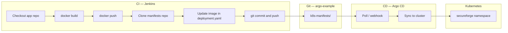

# SecureForge GitOps — Complete Guide

**Task:** Implement **Argo CD for continuous delivery (CD)**, use **existing Jenkins for continuous integration (CI)**, and deploy to an **on-premises Kubernetes cluster** (validated first on Minikube).

**Repository:** [github.com/sreekanthgorrela96/argo-example](https://github.com/sreekanthgorrela96/argo-example)

---

## 1. What you are building

| Role | Tool | Responsibility |
|------|------|----------------|
| **CI** | Jenkins | Build container image, push to registry, update manifest in Git, push commit |
| **Source of truth** | Git (`argo-example`) | Kubernetes manifests (`k8s-manifests/`) including container `image:` |
| **CD** | Argo CD | Watch Git; apply manifests to the cluster; auto-sync / self-heal |
| **Runtime** | Kubernetes (Minikube POC → on-prem prod) | Run `secureforge-ui` Deployment, Service, Ingress |

**Important:** Jenkins does **not** run `kubectl apply` for normal releases. Only Argo CD deploys to the cluster. That separation is the GitOps model.

---

## 2. Architecture



**Data flow (one release):**

1. Developer (or scheduler) triggers Jenkins.
2. Jenkins builds `DOCKER_IMAGE:BUILD_NUMBER` and pushes to Docker Hub.
3. Jenkins clones `argo-example`, changes `image:` in `k8s-manifests/base/deployment.yaml`, commits, pushes to `main`.
4. Argo CD detects the new Git revision and syncs.
5. Kubernetes rolls out new pods with the new image.

---

## 3. Repository layout

| Path | Purpose |
|------|---------|
| `k8s-manifests/` | Kustomize root Argo CD syncs (`path` in Application) |
| `k8s-manifests/base/` | Base Deployment, Service, Ingress, Namespace |
| `k8s-manifests/overlays/dev`, `overlays/prod` | Environment patches (optional) |
| `argocd/application.yaml` | Argo CD Application (repo URL, path, destination, auto-sync) |
| `Jenkinsfile` | CI pipeline: build → push → update Git |
| `Dockerfile` | App image (default: nginx placeholder) |
| `docker-compose.jenkins.yml` | Local Jenkins POC |
| `scripts/` | Minikube, Argo CD install, manifest validation |

---

## 4. Prerequisites

| Component | Requirement |
|-----------|-------------|
| **Machine** | Windows with Docker Desktop (WSL2 recommended), `kubectl`, `git` |
| **Cluster** | Minikube for POC; later kubeconfig for on-prem |
| **Git** | GitHub repo `sreekanthgorrela96/argo-example` (or your fork) |
| **Registry** | Docker Hub (or private registry) — image e.g. `gorrelasreekanth/secureforge-ui` |
| **Jenkins credentials** | `docker-hub-creds`, `github-token-creds` (see [JENKINS-LOCAL.md](JENKINS-LOCAL.md)) |
| **GitHub PAT** | `repo` scope (classic) or **Contents: Read and write** (fine-grained) |

---

## 5. Setup (order matters)

### Step 1 — Cluster (Minikube POC)

```powershell
cd C:\Users\sgorrela\gitops-secureforge
.\scripts\minikube-setup.ps1
kubectl apply -k k8s-manifests
```

Confirm pods: `kubectl get pods -n secureforge`

### Step 2 — Argo CD

```powershell
.\scripts\argocd-install.ps1
```

1. Get admin password:
   ```powershell
   $b = kubectl -n argocd get secret argocd-initial-admin-secret -o jsonpath='{.data.password}'
   [Text.Encoding]::UTF8.GetString([Convert]::FromBase64String($b))
   ```
2. UI: `kubectl port-forward svc/argocd-server -n argocd 9080:443` → `https://localhost:9080` (user `admin`).
3. Edit `argocd/application.yaml` if your Git remote differs, then:
   ```powershell
   kubectl apply -f argocd/application.yaml
   ```
4. In the UI, confirm application **secureforge-ui** is **Synced** and **Healthy**.

### Step 3 — Jenkins (local POC or corporate Jenkins)

```powershell
.\scripts\jenkins-up.ps1
```

Open **http://localhost:8081**, complete setup, add credentials, create Pipeline from SCM — details in [JENKINS-LOCAL.md](JENKINS-LOCAL.md).

| Credential ID | Type | Contents |
|---------------|------|----------|
| `docker-hub-creds` | Username + password | Docker Hub user + token/password |
| `github-token-creds` | Username + password | GitHub username + **PAT** (not the credential ID string) |

Pipeline job:

- SCM: `https://github.com/sreekanthgorrela96/argo-example.git`
- Branch: `*/main`
- Script path: `Jenkinsfile`
- Parameter: `DOCKER_IMAGE` = e.g. `gorrelasreekanth/secureforge-ui`

### Step 4 — Align Jenkinsfile (if using your own fork)

In `Jenkinsfile`, set:

| Variable | Example |
|----------|---------|
| `MANIFESTS_REPO` | `github.com/YOUR_ORG/argo-example.git` |
| `MANIFESTS_BRANCH` | `main` |
| `DOCKER_IMAGE` (parameter default) | `youruser/secureforge-ui` |

---

## 6. Jenkins pipeline (CI)

Stages in [Jenkinsfile](../Jenkinsfile):

1. **Initialize & Validate** — `DOCKER_IMAGE` must not be a placeholder.
2. **Build Docker Image** — `docker build -t ${IMAGE_NAME}:${BUILD_NUMBER} .`
3. **Push to Docker Hub** — login via `docker-hub-creds`, push tag and `latest`.
4. **Update GitOps Manifest** — clone manifests repo with PAT, `sed` update `image:` line, commit, push to `main`.

Manifest update (simplified):

```bash
# Must match the current image line (nginx placeholder or a prior CI tag)
sed -i "s|^[[:space:]]*image:.*|          image: ${IMAGE_NAME}:${TAG}|" k8s-manifests/base/deployment.yaml
```

If Git still shows `nginx` after a green build, the old pattern `image: ${IMAGE_NAME}:.*` did not match — check the job log for **"No manifest changes"**.

**Jenkins must not** deploy to Kubernetes directly.

---

## 7. Argo CD (CD)

[argocd/application.yaml](../argocd/application.yaml) key fields:

```yaml
spec:
  source:
    repoURL: https://github.com/sreekanthgorrela96/argo-example.git
    path: k8s-manifests
    targetRevision: HEAD
  destination:
    server: https://kubernetes.default.svc   # in-cluster (Minikube POC)
    namespace: secureforge
  syncPolicy:
    automated:
      prune: true
      selfHeal: true
```

When Git changes on `main`, Argo CD applies the Kustomize output and Kubernetes performs a rolling update.

---

## 8. Access the application

| Method | Command / URL |
|--------|----------------|
| **Port-forward** | `kubectl port-forward -n secureforge svc/secureforge-ui 8080:80` → http://localhost:8080 |
| **Ingress (Minikube)** | Add `$(minikube ip) secureforge.local` to hosts file → http://secureforge.local |
| **Argo CD UI** | Port-forward `argocd-server` — shows sync status, **not** the app HTML |

---

## 9. Verification checklist

Use this to confirm the full loop is working.

### A. Git-only CD (no Jenkins)

- [ ] Edit `k8s-manifests/base/deployment.yaml` `image:` (e.g. another public tag).
- [ ] Commit and push to `main`.
- [ ] Argo CD application shows new revision and **Synced**.
- [ ] `kubectl get deploy secureforge-ui -n secureforge -o jsonpath='{.spec.template.spec.containers[0].image}'` matches Git.

### B. Full CI → Git → CD loop (Jenkins)

- [ ] Jenkins build **SUCCESS** (all stages green).
- [ ] Docker Hub has image tag = build number.
- [ ] GitHub `main` has new commit on `k8s-manifests/base/deployment.yaml` with updated `image:`.
- [ ] Argo CD syncs within a few minutes (or force refresh — see below).
- [ ] Pods roll out: `kubectl rollout status deployment/secureforge-ui -n secureforge`
- [ ] Running image matches Jenkins tag.

**Force Argo refresh (optional):**

```powershell
kubectl annotate application secureforge-ui -n argocd argocd.argoproj.io/refresh=hard --overwrite
```

### C. Rollback

- Revert the manifest commit in Git, or use Argo CD **History → Rollback**.
- Cluster converges to the previous Git state.

---

## 10. On-premises Kubernetes

Minikube proves the pattern. For production on-prem:

1. Install or connect Argo CD where it can reach both Git and the on-prem API server.
2. Register the cluster:
   ```bash
   argocd login <argocd-host>:443 --grpc-web
   argocd cluster add <kube-context> --name on-prem-prod
   ```
3. Set `spec.destination.server` in `argocd/application.yaml` to the server URL from `argocd cluster list`.
4. Ensure firewall/VPN allows the Argo CD application controller → Kubernetes API.
5. Use private registry pull secrets if needed (`imagePullSecrets` in deployment).

More detail: [ENTERPRISE.md](ENTERPRISE.md)

**Corporate Jenkins:** Point the same Pipeline job at this repo; ensure the agent has Docker, network to registry and `github.com`, and the same credential IDs (or update `Jenkinsfile` IDs to match your Jenkins).

---

## 11. Troubleshooting

| Symptom | Document |
|---------|----------|
| `git push` 403 / permission denied | [GITHUB-GIT-PUSH-403.md](GITHUB-GIT-PUSH-403.md) |
| Docker socket permission denied in Jenkins | [JENKINS-LOCAL.md](JENKINS-LOCAL.md) — `DOCKER_GID` / `jenkins-up.ps1` |
| Argo OutOfSync / sync failed | Check repo URL, branch, path; repo credentials for private Git |
| `ImagePullBackOff` | Wrong image name, private registry without `imagePullSecrets` |
| App still on old image | Argo not synced; check `kubectl get application -n argocd` |

---

## 12. Task completion criteria

| Criterion | POC (Minikube) | On-prem production |
|-----------|----------------|---------------------|
| Argo CD deploys from Git | Yes — Application `secureforge-ui` | Same; change `destination.server` |
| Jenkins builds and pushes image | Yes — with `docker-hub-creds` | Use corporate Jenkins + registry |
| Jenkins updates manifest in Git | Yes — with `github-token-creds`; `sed` replaces **any** `image:` line | Same; branch protection rules may apply |
| Cluster runs declared image | Yes — after sync | Yes — after cluster registered |
| No `kubectl apply` from Jenkins | Yes | Yes |

**“Done” for a demo:** Jenkins green → Git commit on `deployment.yaml` → Argo **Synced** → `kubectl` shows new image on pods.

---

## 13. Related documents

| Document | Contents |
|----------|----------|
| [JENKINS-LOCAL.md](JENKINS-LOCAL.md) | Docker Compose Jenkins, credentials, job setup |
| [E2E-DEMO.md](E2E-DEMO.md) | Short demo checklist for stakeholders |
| [GITHUB-GIT-PUSH-403.md](GITHUB-GIT-PUSH-403.md) | PAT, branch protection, SSO |
| [ENTERPRISE.md](ENTERPRISE.md) | Hardening, on-prem cluster registration |
| [README.md](../README.md) | Quick start index |
